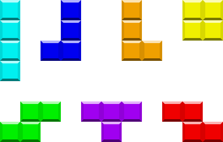
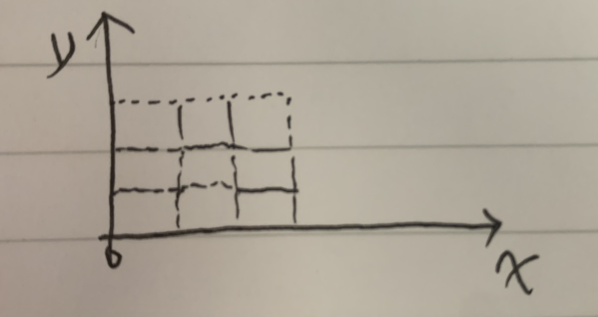
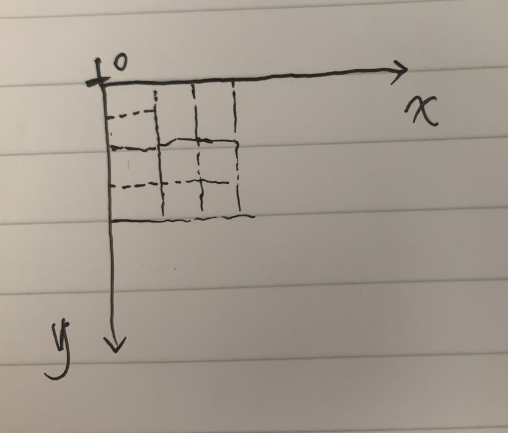
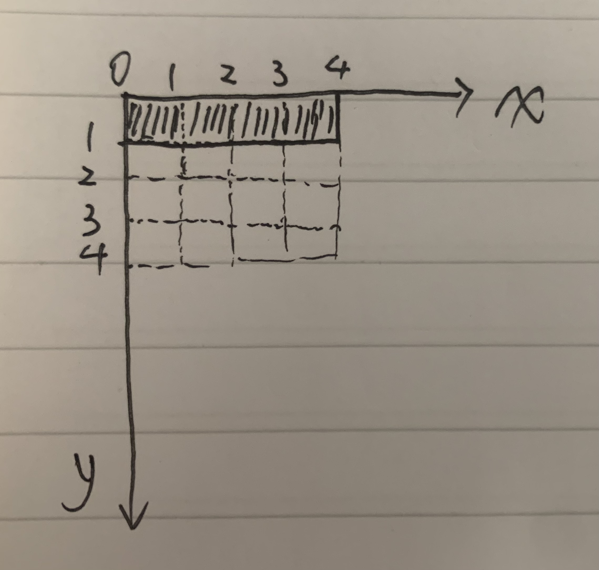
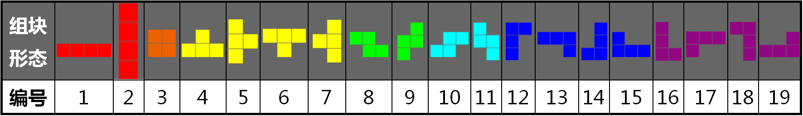

# 俄罗斯方块

## 简单介绍

《俄罗斯方块》（俄语：Тетрис，英语：Tetris），是`1980`年末期至`1990`年代初期风靡全世界的电脑游戏，是落下型益智游戏的始祖，电子游戏领域的代表作之一，为苏联首个在美国发布的娱乐软件。此游戏最初由`阿列克谢·帕基特诺夫`在苏联设计和编写，于1984年6月6日首次发布，当时他正在苏联科学院电算中心工作。此游戏的名称是由希腊语数字“四”的前缀`“tetra-”`（因所有落下方块皆由四块组成）和帕基特诺夫最喜欢的运动网球（`“tennis”`）拼接而成，华语地区则因游戏为俄罗斯人发明普遍称为“俄罗斯方块”。

数字“四”，显而易见，最初的图形都是由4个小方块组成的，这也是俄罗斯方块的一个特点。游戏的目标是通过控制不同形状的方块，使它们在一个矩形的游戏区域中排列成完整的一行或多行，然后这些完整的行就会消除，给玩家得分。

### 游戏规则

- 游戏开始时，游戏区域是一个空白的矩形，玩家通过控制方块的移动和旋转，使它们在游戏区域中排列成完整的一行或多行；
- 当一行或多行被完整填满时，这些行就会消除，给玩家得分；
- 当方块堆积到游戏区域的顶部时，游戏结束。

### 游戏特点

- 游戏简单易上手，但是难度逐渐增加；
- 游戏的速度会随着游戏的进行而逐渐加快；
- 游戏的随机性较大，玩家需要根据当前的情况，灵活地调整方块的位置和旋转。

### 形状

俄罗斯方块中的方块有7种不同的形状，分别是：

- `I`型：一字型；
- `J`型：J型；
- `L`型：L型。
- `O`型：方块型；
- `S`型：S型；
- `T`型：T型；
- `Z`型：Z型；

这些形状是由4个小方块组成的，每个小方块都可以旋转，但是旋转的中心不同。如下图：



各种四格骨牌由左至右，上至下的英文字母代号：I、J、L、O、S、T、Z

### 操作

玩家通过键盘控制方块的移动和旋转，具体操作如下：

- `←`：向左移动方块；
- `→`：向右移动方块；
- `↑`：旋转方块；
- `↓`：加速下落。

### 得分

- 消除一行：得`100`分；
- 消除两行：得`300`分；
- 消除三行：得`700`分；
- 消除四行：得`1500`分。

### 游戏结束

- 当方块堆积到游戏区域的顶部时，游戏结束；
- 游戏结束后，显示游戏结束的提示，并显示玩家的得分。

## 从开发角度看俄罗斯方块

### 坐标系

对于所有二维游戏来说，坐标系是一个非常重要的概念。在俄罗斯方块中，我们可以使用一个二维数组来表示游戏区域，数组的每一个元素表示一个方块，数组的索引表示方块的坐标。如下图：



图中区域表示正数的范围。但是实际情况下，我们可以使用一个二维数组来表示游戏区域。而且计算机在绘画过程中也是自上而下自左而右进行的，因此我们需要将坐标进行变换。如下图：



`x`轴表示列，`y`轴表示行。这样我们就可以通过一个二维数组来表示游戏区域。

对于执行的一个元素，我们可以通过二维数组快速定位到它。

```javascript
const points = [[]]; // 二维数组
const x = 1; // 列
const y = 2; // 行
const point = points[y][x]; // 获取坐标为(1, 2)的元素
```

需要注意的是，数组的索引是从`0`开始的，因此在实际过程中我们将y = 0看成第一行，x = 0看成第一列。

### 方块的表示

按照上述坐标体系的定义，我们可以表示任何一个方块，如当表示`I`型方块时，我们可以定义一个数组来表示它的形状：

```javascript
const IHorizonal = [
  [0, 1, 2, 3]
]
const IVertical = [
  [0],
  [1],
  [2],
  [3]
]
```

如下图：


这样我们就可以通过一个数组来表示一个方块的形状。通过类似的方法，我们可以表示其他的6个方块。但是，I方块有两种形态，我们到底使用哪一种作为初始形态呢？

这里面需要做一个约定，我们定义每个方块的初始化形态。定义如下：

- `I`型：

```javascript
// 口口口口
```

- `J`型：

```javascript
// 口
// 口口口
```

- `L`型：

```javascript
//    口
// 口口口
```

- `O`型：

```javascript
// 口口
// 口口
```

- `S`型：

```javascript
//   口口
// 口口
```

- `T`型：

```javascript
//   口
// 口口口
```

- `Z`型：

```javascript
// 口口
//   口口
```

### 方块的移动

在游戏过程中，方块是可以移动的。分别可以向左移动、向右移动、向下移动。同时移动必须满足如下条件：

1. 移动后的方块不能超出游戏区域；即不能超出游戏区域的左边界、右边界和底边界；翻译成程序语言为：

  ```javascript
  // 向左移动
  if (x - 1 >= 0) {
    x -= 1;
  }
  // 向右移动
  if (x + 1 < width) {
    x += 1;
  }
  // 向下移动
  if (y + 1 < height) {
    y += 1;
  }
  ```

2. 移动后的方块不能与其他方块重叠；即不能与其他方块的坐标重叠；翻译成程序语言为：

  ```javascript
  // 向左移动
  if (x - 1 >= 0 && !isOverlap(x - 1, y)) {
    x -= 1;
  }
  // 向右移动
  if (x + 1 < width && !isOverlap(x + 1, y)) {
    x += 1;
  }
  // 向下移动
  if (y + 1 < height && !isOverlap(x, y + 1)) {
    y += 1;
  }
  ```

上面是描述某个点的情况，实际上判断方块情况，需要所有的点都满足条件。


### 方块的转换

在游戏过程中，方块是可以旋转的。如下图：



同样的，在旋转过程中，也必须曼如如下条件：

1. 旋转后的方块不能超出游戏区域；即不能超出游戏区域的左边界、右边界和底边界；

2. 旋转后的方块不能与其他方块重叠；即不能与其他方块的坐标重叠。

使用程序语言表述如下：

```javascript
// 旋转
const isValid = (newShape) => {
  for (let y = 0; y < newShape.length; y++) {
    for (let x = 0; x < newShape[y].length; x++) {
      if (newShape[y][x] && (x < 0 || x >= width || y >= height || isOverlap(x, y))) {
        return false;
      }
    }
  }
  return true;
}
const newShape = rotate(shape);
if (isValid(newShape)) {
  shape = newShape;
}
```

接下来问题来，如何实现`rotate`函数呢？这里面就涉及到了方块的旋转。对于不同的方块，旋转的方式是不同的。

如I型方块，其旋转形态只有两种，分别是横向和纵向。

```javascript
// I型方块
// 横向
// 口口口口
// 纵向
// 口
// 口
// 口
// 口
```

但是对于T型等其他方块，其旋转形态是四种的。

```javascript
// T型方块
// 1
// 　口
// 口口口
// 2
// 口
// 口口
// 口
// 3
// 口口口
// 　口
// 4
// 　口
// 口口
// 　口
```

我们当然可以通过枚举的方式将所有的旋转形态都列出来，但是这样的方式是不可取的。因为这样的方式会使得代码变得复杂，而且不易维护。因此我们需要找到一种更好的方式来实现方块的旋转。

实际上，我们可以通过观察发现，方块的旋转是围绕一个中心点进行的。且旋转方向和角度是固定的。

因此我们可以得出如下结论：

1. 方块的旋转是围绕一个中心点进行的；选择的中心点是不动的。

2. 方块的旋转方向和角度是固定，我们可以选取逆时针旋转，相对我们定义的坐标系统旋转角度为 π / 2。 故根据旋转公式，新坐标定义如下：

```javascript
  const newX = Math.cos(Math.PI / 2) * (x - centerX) - Math.sin(Math.PI / 2) * (y - centerY) + centerX;

  const newY = Math.cos(Math.PI / 2) * (y - centerY) + Math.sin(Math.PI / 2) * (x - centerX) + centerY;

```

  即

```javascript
  const newX = -y + centerY + centerX;
  const newY =  x - centerX +  centerY;
```

此处不太了解的可以去看看[坐标旋转](https://blog.csdn.net/sinat_33425327/article/details/78333946)。

## 小结

上面我们讨论了俄罗斯方块的基本介绍，从开发的角度来看，我们讨论了坐标系、方块的表示、方块的移动和方块的旋转。那么我们可以通过如下两个实体在表示方块的基本情况。

1. Point，坐标点

```javascript
interface PointAttr {
  color?: string; // 颜色
  isReadyToClean?: boolean; // 是否准备消除
  [key: string]: any; // 其他属性
}

class Point {
  private x: number;
  private y: number;
  private attr: PointAttr;
  constructor(x, y, attr?: PointAttr) {
    this.x = x;
    this.y = y;
    this.attr = attr || {};
  }
}
```

每个坐标点均包含了x、y坐标，以及其他属性，如颜色等；

2. Block，方块

```javascript
class Block {
  private points: Point[];
  private rotateIndex: number; /// 旋转因子
  constructor(points: Point[]) {
    this.points = points;
  }
  abstract getCenterIndex(): number; // 获取中心点
  abstract getRotateArray(); number[]; // 获取旋转数组
}
```

其他的方块均继承自Block，实现`getCenterIndex`和`getRotateArray`方法。

如IBlcok，其实现如下：

```javascript
class IBlock extends Block {
  getCenterIndex() {
    return 1;
  }
  getRotateArray() {
    return [
      Math.PI / 2, // 第一次旋转相对于初始位置的角度
      -Math.PI / 2 // 第二次旋转相对于第一次旋转的角度
    ]
  }
}
```

本章内容暂时就到这里，后续章节我们将继续讨论如何实现俄罗斯方块的游戏逻辑。