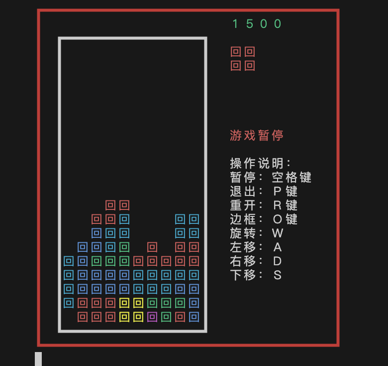

# 手撸俄罗斯方块——游戏主题

当确定游戏载体（如控制台）后，界面将呈现出来。但是游戏的背景色、方块的颜色、方框颜色都应该支持扩展。

当前游戏也是如此，引入了 Theme 的概念，支持主题的扩展。

## AbstractTheme

系统抽象了一个`AbstractTheme`，它将一些渲染过程中的行为进行了抽象，抽象定义如下：

```javascript
abstract class AbstractTheme {
  /**
   * 设置外框的样式，如外框的颜色、整体的背景等。
   * @param outer 指代外框对象的元素，通过修改其内容改变显示样式。
   */
  abstract outStyle(outer: any): void;
  /**
   * 设置内框的样式，如内框的颜色、整体的背景等。
   * @param inner 指代内框对象的元素，通过修改其内容改变显示样式。
   */
  abstract innerStyle(inner: any): void;
  /**
   * 设置分数的样式。
   * @param score 指代分数对象的元素，通过修改其内容改变显示样式。
   */
  abstract scoreStyle(score: any): void;
  /**
   * 设置状态栏的样式
   * @param status 指代状态对象的元素。
   */
  abstract statusStyle(status: any): void;
  /**
   * 分数的格式化字符串，输入一个分数的数字，将其转换为目标的样式；
   * @param score {number} 当前游戏的分数
   */
  abstract scoreTemplate(score: number): string;
  abstract nextStyle(blocks: any): void;
  abstract currentStyle(current: any): void;
  /**
   * 设置方块区域的样式
   * @param block 指代当前方块区域
   */
  abstract blockStyle(block: any): void;
  /**
   * 设置current区域和已填充区域的小方块的样式
   * @param blockItem 当前小方块，如一个IBlock会拆分成4各BlockItem。
   * @param point 当前小方块的位置信息，包括`x`轴和`y`轴的坐标等信息
   */
  abstract blockPointStyle(blockItem: any, point: Point): void;
  /**
   * 设置next区域的小方块的样式
   * @param blockItem
   * @param point
   */
  abstract nextPointStyle(blockItem: any, point: Point): void;
}
```

注释已经描述得比较清晰了，分别对外框、内框等进行了设定。

## 控制台如何实现主题

为了使主题生效，需要在`AbstractCanvas`子类中调用`Theme`提供的方法。这里以`ConsoleCanvas`为例，它的实现如下：

```javascript
export class ConsoleCanvas extends AbstractCanvas {
  render(): void {
    const { game } = this;
    if (!game) {
      return;
    }
    const { stage, dimension } = game;
    const printArray: string[] = [];
    console.clear();
    const { score, current, next } = stage;
    const { xSize, ySize } = dimension;
    const outLength = 1 + 1 + xSize + 1 + this.rightWidth + 1;
    if (!this.isHideOuter) {
      // 1. 渲染外边框的上边框
      const outLine1 = this.getOutterLine(
        this.outerLeftTopChar +
          this.createChar(xSize + 2 + this.rightWidth, this.horizonalChar) +
          this.outerRightTopChar
      );
      printArray.push(outLine1);
    }

    // 2. 渲染score
    const scoreText = this.theme.scoreTemplate(score);
    const scoreConsoleChar = ConsoleChar.create(scoreText);
    this.theme.scoreStyle(scoreConsoleChar);
    // 计算左侧需要补充的空格
    const leftSpace = this.rightWidth - scoreText.length - 3;
    // 右侧需要补充的空格
    const rightSpace = 3;
    let scoreLine =
      this.getOutterLine(this.outerLeftVerticalChar) +
      this.createChar(xSize + 2 + leftSpace) +
      scoreConsoleChar.ch +
      this.createChar(rightSpace) +
      this.getOutterLine(this.outerRightVerticalChar);
    printArray.push(scoreLine);

    // 3. 渲染内边框的上边框
    let line1 =
      this.getOutterLine(this.outerLeftVerticalChar) +
      this.getInnerLine(this.innerLeftTopChar);
    for (let x = 0; x < xSize; x++) {
      const oneBlockItem = current?.points.find((item) => item.x === x);
      if (oneBlockItem) {
        line1 += this.getInnerLine(bold(this.horizonalChar));
      } else {
        line1 += this.getInnerLine(this.horizonalChar);
      }
    }
    line1 +=
      this.getInnerLine(this.innerRightTopChar) +
      this.createChar(this.rightWidth) +
      this.getOutterLine(this.outerRightVerticalChar);
    printArray.push(line1);
    let line2 =
      this.getOutterLine(this.outerLeftVerticalChar) +
      this.getInnerLine(this.innerLeftBottomChar);
    for (let x = 0; x < xSize; x++) {
      const oneBlockItem = current?.points.find((item) => item.x === x);
      if (oneBlockItem) {
        line2 += this.getInnerLine(bold(this.horizonalChar));
      } else {
        line2 += this.getInnerLine(this.horizonalChar);
      }
    }
    line2 +=
      this.getInnerLine(this.innerRightBottomChar) +
      this.createChar(this.rightWidth) +
      this.getOutterLine(this.outerRightVerticalChar);
    printArray.push(line2);
    if (!this.isHideOuter) {
      const outLine2 = this.getOutterLine(
        this.outerLeftBottomChar +
          this.createChar(xSize + 2 + this.rightWidth, this.horizonalChar) +
          this.outerRightBottomChar
      );
      printArray.push(outLine2);
    }
    if (this.exitMessage) {
      printArray.push(this.exitMessage);
    } else {
      printArray.push("");
    }
    process.stdout.write(this.handleOutput(outLength, printArray).join("\n"));
  }
}
```

我们看到渲染上边框，调用了`getOutterLine`方法，这个方法是在`AbstractCanvas`中定义的，它的实现如下：

```javascript
export class ConsoleCanvas extends AbstractCanvas {
  // ...
  getOutterLine(char: string): string {
    if (this.isHideOuter) {
      return "";
    }
    const consoleChar = new ConsoleChar(str || "|");
    this.theme.outStyle(consoleChar);
    return consoleChar.ch;
  }
  // ...
}
```

它内部调用了 theme.outStyle 方法，对应我们上述 theme 的定义。

类似的，对于内边框的渲染，也是调用了`getInnerLine`方法，它的实现如下：

```javascript
export class ConsoleCanvas extends AbstractCanvas {
  // ...
  getInnerLine(char: string): string {
    const consoleChar = new ConsoleChar(str || "|");
    this.theme.innerStyle(consoleChar);
    return consoleChar.ch;
  }
  // ...
}
```

这样，我们就实现了主题的扩展。

## 主题的扩展

我们可以通过继承`AbstractTheme`，实现自己的主题，比如实现一个`RedTheme`：

```javascript
export class RedTheme extends DefaultTheme {
  outStyle(outer: any): void {
    outer.ch = color.red(outer.ch);
  }
}
```

它实现了`outStyle`方法，将外边框的颜色设置为红色。

我们使用该主题，效果如下


