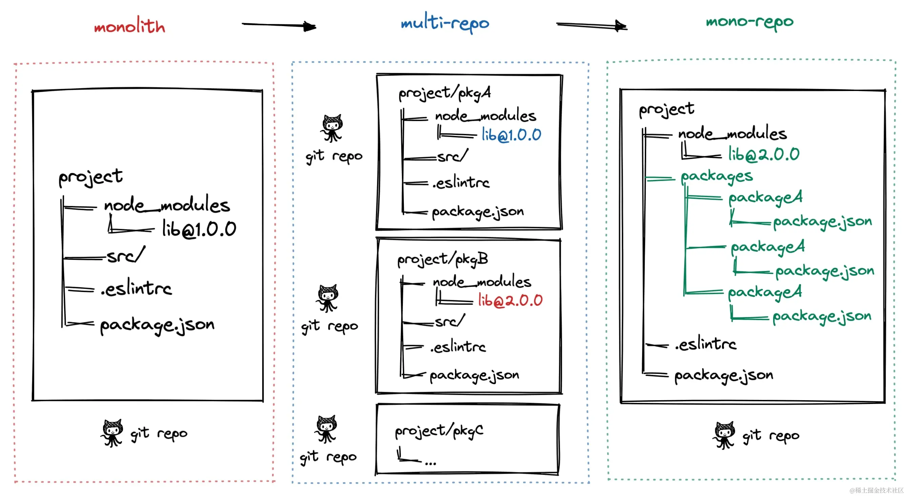

# 手撸俄罗斯方块———聊聊大仓

本项目采用了大仓的模式，它的一个典型特征是通过组合的方式将多个功能独立且相互以来的模块组合在一起，形成一个完整的系统。本文将阐述为什么采用这种方式，以及如何实现。

## 大仓的演进

大仓（monorepo）并不是一开始就存在的，它是项目的演进过程中，随着项目规模的增大，代码复用的需求，以及团队协作的需求，逐渐形成的。在项目初期，由于代码量较小，团队规模较小，代码复用的需求不强烈，因此采用单仓的方式即可。但随着项目的发展，代码量逐渐增大，团队规模逐渐扩大，代码复用的需求逐渐增强，此时单仓的方式已经无法满足需求，因此需要将代码拆分成多个模块，每个模块独立开发，独立测试，独立部署，最后再将这些模块组合在一起形成一个完整的系统。如下图：



- **阶段一：单仓库巨石应用**， 一个 Git 仓库维护着项目代码，随着迭代业务复杂度的提升，项目代码会变得越来越多，越来越复杂，大量代码构建效率也会降低，最终导致了单体巨石应用，这种代码管理方式称之为`Monolith`。

- **阶段二：多仓库多模块应用**，于是将项目拆解成多个业务模块，并在多个 Git 仓库管理，模块解耦，降低了巨石应用的复杂度，每个模块都可以独立编码、测试、发版，代码管理变得简化，构建效率也得以提升，这种代码管理方式称之为`MultiRepo`。

- **阶段三：单仓库多模块应用**，随着业务复杂度的提升，模块仓库越来越多，`MultiRepo`这种方式虽然从业务上解耦了，但增加了项目工程管理的难度，随着模块仓库达到一定数量级，会有几个问题：

  - 跨仓库代码难共享。就前端而言，通过 npm 包管理，但是每次发布都需要发布到 npm 仓库，增加了发布成本；或者通过`npm link`这种方式，如果是多人协作，每个人都需要手动链接，不利于团队协作。
  - 分散在单仓库的模块依赖管理复杂（底层模块升级后，其他上层依赖需要及时更新，否则有问题）。
  - 增加了构建耗时。

  于是将多个项目集成到一个仓库下，共享工程配置，同时又快捷地共享模块代码，成为趋势，这种代码管理方式称之为`MonoRepo`。

## 大仓的优缺点

在这里我们不妨比对一下`Monolith`、`MultiRepo`、`MonoRepo`三种代码管理方式的优缺点：

| 场景       | Monolith                                                                                                           | MultiRepo                                                                                                                                                                                                                                                              | MonoRepo                                                                                                                                                                                                                                                                           |
| ---------- | ------------------------------------------------------------------------------------------------------------------ | ---------------------------------------------------------------------------------------------------------------------------------------------------------------------------------------------------------------------------------------------------------------------- | ---------------------------------------------------------------------------------------------------------------------------------------------------------------------------------------------------------------------------------------------------------------------------------- |
| 代码可见性 | ✅ 一个仓库中多个相关项目，很容易看到整个代码库的变化趋势，更好的团队协作。<br /> ❌ 增加了非 owner 改动代码的风险 | ✅ 一个仓库一个项目，代码可见性高，更容易维护。                                                                                                                                                                                                                        | 同`monolith`                                                                                                                                                                                                                                                                       |
| 依赖管理   | ✅ 嵌入项目内部，直接引用。<br /> ❌ 通过文件引用，不利于维护                                                      | ❌ 通过 npm link 或者发布到 npm，不利于团队协作。                                                                                                                                                                                                                      | ✅ 依赖管理简单                                                                                                                                                                                                                                                                    |
| 代码权限   | ❌ 一个仓库，无法精准控制，强行精准控制可能会导致构建异常                                                          | ✅ 多个仓库，权限管理简单。                                                                                                                                                                                                                                            | ❌ 一个仓库，精准控制成本高                                                                                                                                                                                                                                                        |
| 开发迭代   | -                                                                                                                  | ✅ 仓库体积小，模块划分清晰，可维护性强。<br /> ❌ 多仓库来回切换（编辑器及命令行），项目多的话效率很低。多仓库见存在依赖时，需要手动 npm link，操作繁琐。<br/> ❌ 依赖管理不便，多个依赖可能在多个仓库中存在不同版本，重复安装，npm link 时不同项目的依赖会存在冲突。 | ✅ 多个项目都在一个仓库中，可看到相关项目全貌，编码非常方便。<br /> ✅ 代码复用高，方便进行代码重构。<br /> ❌ 多项目在一个仓库中，代码体积多大几个 G，git clone 时间较长。<br /> ✅ 依赖调试方便，依赖包迭代场景下，借助工具自动 npm link，直接使用最新版本依赖，简化了操作流程。 |
| 工程配置   | ✅ 多项目在一个仓库，工程配置一致，代码质量标准及风格也很容易一                                                    | ❌ 各项目构建、打包、代码校验都各自维护，不一致时会导致代码差异或构建差异。                                                                                                                                                                                            | ✅ 多项目在一个仓库，工程配置一致，代码质量标准及风格也很容易一致。                                                                                                                                                                                                                |
| 构建部署   | ✅ 一个仓库，构建部署简单 <br /> ❌ 每每次均全量构建，构建成本高                                                   | ❌ 多个仓库，构建部署复，升级成本高 ❌ 构建配置可能不一致，可能影响最终构建产物                                                                                                                                                                                        | ✅ 一个仓库，构建部署简单                                                                                                                                                                                                                                                          |

很明显，`MonoRepo`是最优的选择，它综合了`Monolith`和`MultiRepo`的优点，同时避免了它们的缺点。

同时，针对需要控制文件级的权限，当前`git`暂时做不到这一点，在大厂内部已经开始探索了文件级权限控制，相信未来会有更好的解决方案。

## 如何实现的

对于我们项目而言，我们采用`yarn + lerna`的方式进行大仓控制。yarn 用于管理依赖，lerna 用于控制包的发布。

具体操作流程如下：

1. 项目结构，packages 存放所有的工具包，app 存放 web 包。

2. 修改`package.json`，添加`workspaces`字段，指定所有的包。

```json
{
  "workspaces": ["packages/*", "app"]
}
```

执行命令： `yarn workspaces info`，可以查看所有的包。查看它们彼此的依赖情况。

类似如下的结果：

```bash
$ yarn workspaces info
{
  "@shushanfx/tetris-core": {
    "location": "packages/core",
    "workspaceDependencies": [],
    "mismatchedWorkspaceDependencies": []
  },
  "@shushanfx/tetris-console": {
    "location": "packages/console",
    "workspaceDependencies": [
      "@shushanfx/tetris-core"
    ],
    "mismatchedWorkspaceDependencies": []
  },
  "@shushanfx/tetris-web": {
    "location": "packages/web",
    "workspaceDependencies": [
      "@shushanfx/tetris-core"
    ],
    "mismatchedWorkspaceDependencies": []
  },
  "app": {
    "location": "app",
    "workspaceDependencies": [
      "@shushanfx/tetris-core",
      "@shushanfx/tetris-web"
    ],
    "mismatchedWorkspaceDependencies": []
  }
}
```

由上面我们可以看出，workspaces 被 yarn 识别了。 关系如下：

- `@shushanfx/tetris-core`： 无依赖
- `@shushanfx/tetris-console`： 依赖`@shushanfx/tetris-core`
- `@shushanfx/tetris-web`： 依赖`@shushanfx/tetris-core`
- `app`： 依赖`@shushanfx/tetris-core`和`@shushanfx/tetris-web`

3. `lerna`配置文件`lerna.json`，指定`lerna`的配置。

```json
{
  "$schema": "node_modules/lerna/schemas/lerna-schema.json",
  "version": "1.0.3",
  "npmClient": "yarn"
}
```

一个重要的配置是使用`npmClient`： `yarn`，这样`lerna`会使用`yarn`来安装依赖。

如此，我们基本上完成了大仓的配置。

## 如何运作
